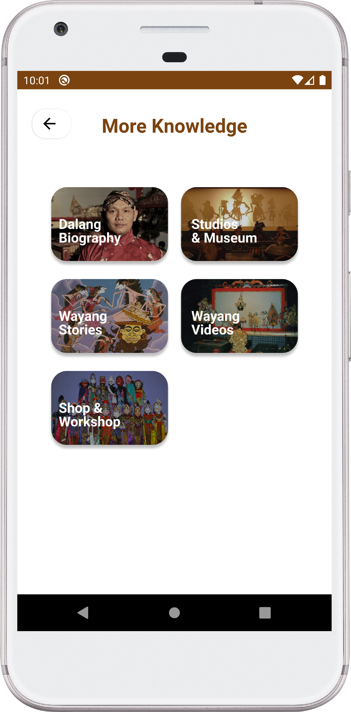

# Dalang App - Capstone Bangkit 2022

 

  

  <h3 align="center">Dalang App</h3>
  
<b>Application for Wayang Education and Identification using ML
    </b>

 
<h2>Project Background</h2>
Culture is an invaluable heritage of our ancestors. Culture is also a national identity that makes us have different characteristics from other countries. One of Indonesia's cultural heritages that are starting to fade and must be preserved is wayang. As the next generation, we are obliged to introduce wayang to future generations and also to the international community. In this modern era, one effective way is to create wayang recognition technology. We take this opportunity as an effort to help preserve Indonesian culture which will be applied with technology. A technology that we named “Dalang” will help us to get to know wayang more deeply starting from its type, area of ​​origin, description, and other information by taking pictures of wayang then "Dalang" will perform classification and display the results of the classification of puppets.
  

## App Overview

  
  
  

 

**Features**
1. Classify types of wayang using image from your camera or gallery
2. Wayang Gallery to see all types of wayang and the detail
3. Language setting IN-ENG
4. Video about basic wayang technique
5. More Knowledge to learn more all related things about wayang
6. You can still using the Wayang Classification feature even without internet

**Technology**
1. Using Machine Learning Tensorflow / tflite
2. Using API to load all asset data
3. Navigation component for android
4. Localization (IN-ENG)
5. Fresh and interactive User Interface

## Our Team
This project is a Product Capstone submission from the C22-PS012 group for Studi Independen Kampus Merdeka of Bangkit 2022. Contributors of this project are:
<ol>
<li>Muhammad Gibran Fadilla (M2002G0076) - Machine Learning</li>
<li>Muhammad Faisal Anshory (M2002G0077) - Machine Learning</li>
<li>Dzalfikri Ali Zidan (A2009G0963) - Mobile Development</li>
<li>M Yayang Setiawan ( A2009G0973) - Mobile Development</li>
<li>Taopik Hidayat (C2222W2028) - Cloud Computing</li>
<li>Nur Ayu Sulistiani (C7224X2043) - Cloud Computing</li>
</ol>

## Tools, Library & Frameworks
* [Tensorflow](https://www.tensorflow.org/)
* [Keras](https://keras.io/)
* [Google Cloud Platform](https://cloud.google.com/)
* [Javascript](https://www.javascript.com/)
* [MySQL](https://www.mysql.com/)
* [Dbeaver](https://dbeaver.io/)
* [Android Studio](https://developer.android.com/studio)
* [Kotlin](https://kotlinlang.org/)
* [Retrofit](https://square.github.io/retrofit/) 

## Android Library
* TensorFlow Lite
* Retrofit
* Preferences
* Material Design
* ViewBinding
* LiveData
* Logging Interceptor
* Glide
* ViewPager2

## Links
* [APK Download](https://drive.google.com/file/d/1lJVZJzX8SgBgX-nJzSxlwVI9NXnZTTgE/view?usp=sharing)
* [Figma](https://www.figma.com/file/nucW6whJLmSe9STklMwRFV/Dalang-Apps?node-id=0%3A1)  
